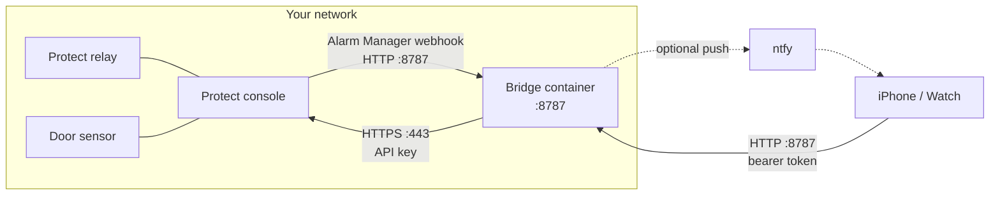

# Garage Opener bridge

The service behind [**Garage Opener**](https://garageopener.app), a smart garage door built on a UniFi
Protect relay and a garage-mounted door sensor. It talks to your Protect console, keeps the door state
machine, serves the iOS app, and runs the alert rules whether or not a phone is awake.

**Every command is verified against the door sensor.** The relay is fired, then the sensor is read: *open*
means the door is open, not that a relay clicked. When the door doesn't do what it was asked, the API says so
rather than reporting success.

```
ghcr.io/pcrausaz/garage-opener-bridge
```

Node 22, TypeScript strict, Fastify, SQLite. Multi-arch (amd64, arm64).

## Running it

Start at **https://garageopener.app/self-hosting** — the full guide, including the Protect API key, the relay
and sensor setup, certificates and remote access. The short version:

```bash
mkdir garage-bridge && cd garage-bridge
curl -fsSLO https://raw.githubusercontent.com/pcrausaz/garage-opener-bridge/main/selfhost/docker-compose.yml
curl -fsSL  https://raw.githubusercontent.com/pcrausaz/garage-opener-bridge/main/selfhost/.env.example -o .env
# fill in the required values in .env (generate secrets with `openssl rand -hex 24`), then:
docker compose up -d
curl -s localhost:8787/healthz
```

Using Dockhand, Portainer or another stack manager? Paste
[`selfhost/docker-compose.yml`](selfhost/docker-compose.yml) as the stack and set the variables from
[`selfhost/.env.example`](selfhost/.env.example) in the stack's environment; the compose lists every setting
explicitly, so no `.env` file is needed.

You do **not** put an admin token into the app. While no phone has joined, the bridge prints a single-use
invite link at startup (`docker logs garage-bridge`). On the app's first screen, tap **Join with an invite** and
paste it, or open the link on the phone.

## How it fits together



With a bridge, it is the only thing that talks to the console, and the app talks only to the bridge. Nothing here
calls a Garage Opener cloud service; the optional cloud alerts are for setups *without* a bridge.

## Network requirements

| From | To | Port / protocol | Needed for | Required |
|---|---|---|---|---|
| Bridge host | Protect console | TCP 443, HTTPS | Polling the sensor, pressing the relay | Always |
| Protect console | Bridge host | TCP 8787, HTTP | Alarm Manager webhooks: instant door updates | Recommended (the bridge polls anyway) |
| Phone | Bridge host | TCP 8787, HTTP (REST + a long-lived event stream) | The app, widgets, Watch, Shortcuts | Always: on the LAN, or over a VPN or tunnel away from home |
| Phone | Bridge host | UDP 5353, mDNS `_garage-opener._tcp` | Finding the bridge without typing its address | Optional; needs host networking, and does not cross VLANs without an mDNS reflector |
| Bridge host | your ntfy server or ntfy.sh | HTTP(S) | Push alerts to a phone that is asleep or away | Optional |
| Bridge host | `ghcr.io` | TCP 443 | Pulling the image | At install and update |

If the bridge host and the console are on different VLANs, the firewall must allow both directions above:
bridge → console on 443, and console → bridge on 8787. Never forward a port from the internet to the bridge.

## What it does

| | |
|---|---|
| Door | State machine on the sensor, verified open/close/stop, direction memory for a door stopped part-way |
| Alerts | Open too long, nightly check, vehicle-in-garage heuristic, hold-open to silence them |
| Family | One-time invites, per-member tokens, rename and revoke, an activity log that names people |
| Integrations | Bonjour discovery, Alarm Manager webhooks in, ntfy and HMAC-signed webhooks out, SSE event stream |
| Mock mode | An in-memory simulator with no console and no credentials, per-token isolated |

The HTTP API is `contract/bridge.openapi.yaml`. A test diffs it against the routes the server actually
registers, so the spec cannot quietly fall behind the implementation.

## Development

```bash
pnpm install
pnpm test          # OpenAPI lint + generated-types drift check + unit, integration, contract and e2e suites
pnpm typecheck
BRIDGE_MODE=mock BRIDGE_TOKENS=demo-token-123 pnpm dev    # mock mode on :8787
```

`pnpm test:live` runs read-only checks against a real console and is opt-in; it is never run in CI. No test
touches real hardware.

See [`CONTRIBUTING.md`](CONTRIBUTING.md). Changes to the API mean editing the spec and running
`pnpm contract:generate`.

## Security

A review was carried out before this repository was published:
[`docs/security-review.md`](docs/security-review.md). It is published in full, including what was accepted
rather than fixed. Reporting: [`SECURITY.md`](SECURITY.md).

Two things matter most if you run this: **generate `BRIDGE_TOKENS`** (it opens your garage door), and **don't
port-forward the bridge** — use a VPN, tunnel or reverse proxy.

## What isn't here

The **iOS and watchOS app** is closed source. The **cloud-alerts service** is too: it holds no credential to
anyone's console, cannot actuate anything, and nobody can self-host it, since pushes need the app's APNs key.
What it stores is set out at https://garageopener.app/privacy.

Out of scope by design: more than one door per bridge, relays other than UniFi Protect's, Home Assistant.

## Licence

[Apache-2.0](LICENSE). Please read [`NOTICE`](NOTICE): the code is free to fork and redistribute, the name
**Garage Opener**, the icon and `garageopener.app` are not.

"UniFi" and "UniFi Protect" are trademarks of Ubiquiti Inc. This project is not affiliated with, endorsed by
or sponsored by Ubiquiti.
